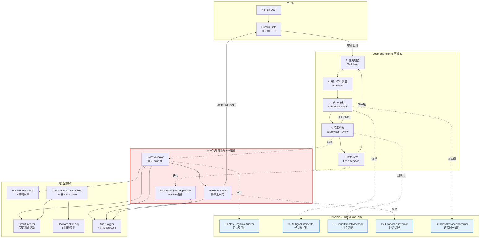
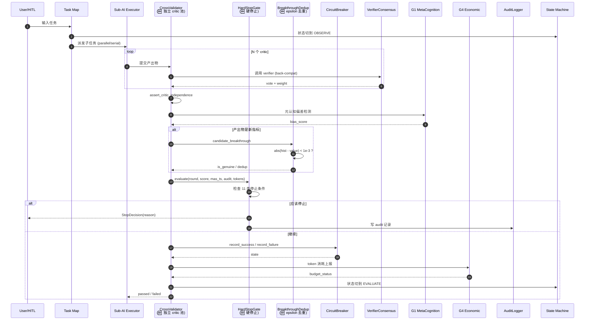
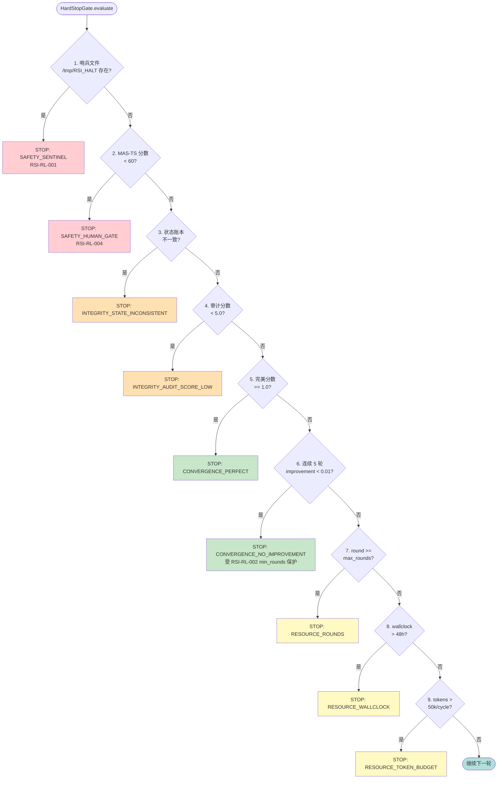
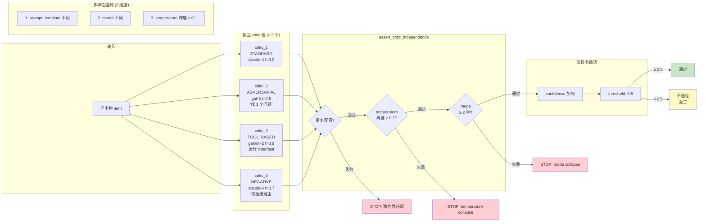
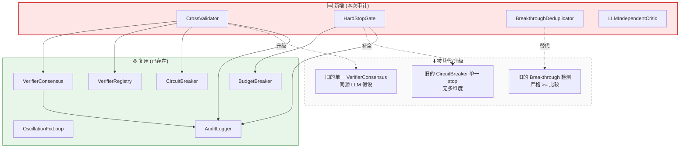
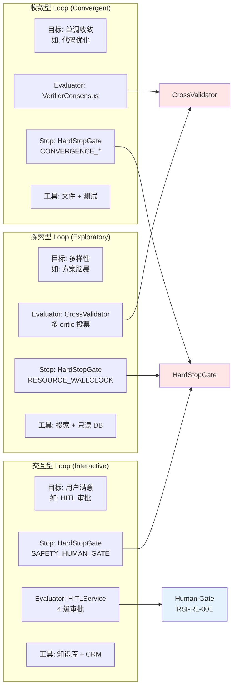
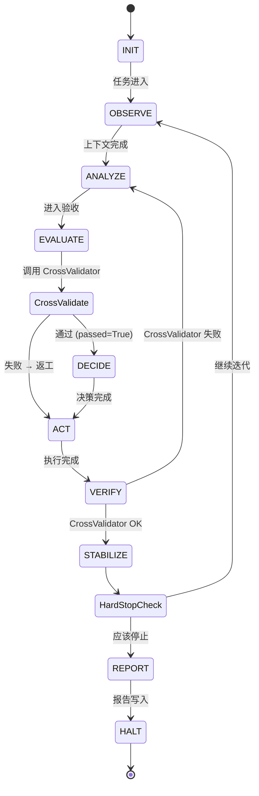

# MAREF × Loop Engineering 集成架构蓝图

> **版本**：v0.36.0-rc
> **日期**：2026-07-13
> **审计关联**：[loop-engineering-audit-20260713.md](../loop-engineering-audit-20260713.md)
> **实现位置**：`src/maref/governance/cross_validator.py`

本文档用 Mermaid 描述 Loop Engineering 五要素与 MAREF 三层治理的完整数据流，标注本次审计新增的 3 个 P0 组件（**独立 critic 池 / 硬停止闸门 / epsilon 去重**）。

---

## 一、整体架构总览



---

## 二、单轮循环数据流（最详细）



---

## 三、硬停止闸门决策树（11 类停止条件）



---

## 四、独立 critic 池投票机制



---

## 五、Epsilon 去重：RSI 48h run 教训修复

```mermaid
flowchart TB
    subgraph Problem["❌ RSI 48h run (PID 91372) 根因"]
        P1[cycle 50: 0.9900]
        P2[cycle 80: 0.9904]
        P3[cycle 110: 0.9901]
        P4[cycle 140: 0.9903]
        P5[cycle 200: 0.9902]
        P_RES[连续 34h metric 卡 0.99<br/>breakthroughs 误报泛滥<br/>MetaRatchet 仅诊断 saturation<br/>未采取实质行动]
    end

    subgraph Fix["✅ 修复方案: BreakthroughDeduplicator"]
        F1[candidate value]
        F2{abs hist - value<br/>&lt; epsilon=1e-3 ?}
        F3[is_genuine = False<br/>写入历史但不算突破]
        F4[is_genuine = True<br/>best_value 更新]
        F5[真实突破<br/>+0.01 级别<br/>才触发报告]
    end

    P1 --> P_RES
    P2 --> P_RES
    P3 --> P_RES
    P4 --> P_RES
    P5 --> P_RES

    P_RES -.教训.-> F1
    F1 --> F2
    F2 -->|是 (噪声)| F3
    F2 -->|否 (真实)| F4
    F4 --> F5

    style P_RES fill:#ffcdd2
    style F3 fill:#fff9c4
    style F5 fill:#c8e6c9
```

---

## 六、与现有模块的关系（向后兼容）



---

## 七、三种 Loop 元模式 × MAREF 治理映射



---

## 八、状态机集成（10 态 Gray Code）



---

## 九、文件落点与导入路径

| 组件 | 文件路径 | 导出符号 |
|------|---------|---------|
| CrossValidator | `src/maref/governance/cross_validator.py` | `CrossValidator`, `CrossValidatorConfig` |
| HardStopGate | 同上 | `HardStopGate`, `StopReason`, `StopDecision` |
| BreakthroughDeduplicator | 同上 | `BreakthroughDeduplicator`, `BreakthroughRecord` |
| IndependentCritic | 同上 | `IndependentCritic`, `LLMIndependentCritic`, `CriticMode`, `CriticVerdict` |
| Independence check | 同上 | `assert_critic_independence` |
| Constants | 同上 | `HARD_STOP_HUMAN_GATE`, `DEFAULT_DEDUP_EPSILON`, `DEFAULT_MAS_TS_FLOOR`, `DEFAULT_MIN_ROUNDS`, `DEFAULT_TOKENS_PER_CYCLE`, `DEFAULT_MAX_WALLCLOCK_HOURS` |

**使用示例**：

```python
from maref.governance import (
    CrossValidator, CrossValidatorConfig,
    HardStopGate, BreakthroughDeduplicator,
    LLMIndependentCritic, CriticMode,
    HARD_STOP_HUMAN_GATE,
)

# 配置硬停止 + 去重
hard_stop = HardStopGate(
    sentinel_path=HARD_STOP_HUMAN_GATE,  # /tmp/RSI_HALT
    min_rounds=10,  # RSI-RL-002
    max_tokens_per_cycle=50_000,
)
dedup = BreakthroughDeduplicator(epsilon=1e-3)

cv = CrossValidator(config=CrossValidatorConfig(
    hard_stop=hard_stop,
    dedup=dedup,
    min_agreement=0.5,
))

# 注册 3 个独立 critic (不同 model/temperature/mode)
cv.register_critics([
    LLMIndependentCritic("c1", "claude-4", "P1 {item}", 0.0, CriticMode.STANDARD),
    LLMIndependentCritic("c2", "gpt-5", "P2 {item}", 0.5, CriticMode.ADVERSARIAL),
    LLMIndependentCritic("c3", "gemini-2", "P3 {item}", 0.9, CriticMode.TOOL_BASED),
])

# 每轮循环调用
result = cv.validate(
    item=output,
    round_num=cycle,
    current_score=score,
    mas_ts_score=mas_ts,
    tokens_used_this_cycle=tokens,
    candidate_breakthrough=score,  # 去重
)

if result.stop.should_stop:
    logger.warning("STOP: %s", result.stop.reason)
    break
```

---

## 十、版本与路线图

| 版本 | Loop Engineering 治理交付 |
|------|---------------------------|
| v0.35.0-rc | 叙事层 + 文档 + 三种元模式架构设计 |
| v0.36.0-rc | `maref.loop` 模块 + CrossValidator (本文档) + HardStopGate + BreakthroughDeduplicator |
| v1.0 | 全栈递归进化 + Agent 信用评级 + 四象治理模型 + 48h 长循环稳定运行验证 |
