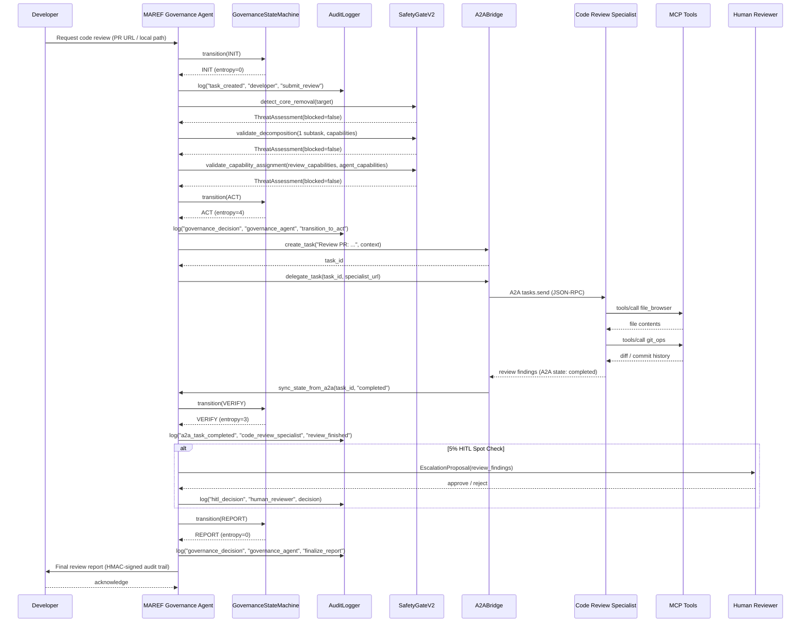

# Governed Code Review — MAREF 治理的代码审查 Agent

> **Scenario ID**: S-GCR-001  
> **Version**: 1.0  
> **Last Updated**: 2026-06-17  
> **Status**: Active

## Overview

This scenario demonstrates a complete governed code review flow using MAREF's governance lifecycle. A Developer submits a PR for review, and the MAREF Governance Agent orchestrates the review through the 10-state Gray code state machine, delegating to a Code Review Specialist via A2A protocol, applying SafetyGateV2 checks, and routing a 5% HITL spot check to a Human Reviewer.

## Actors

| Actor | Role |
|-------|------|
| **Developer** | Submits a pull request or local code for review via the MAREF CLI |
| **MAREF Governance Agent** | Orchestrates the review through the governance lifecycle (INIT → ACT → VERIFY → REPORT) using the GovernanceStateMachine |
| **Code Review Specialist Agent** | Receives delegated review tasks via A2A protocol, executes MCP tools (`file_browser`, `git_ops`) for code analysis, returns findings |
| **Human Reviewer** | Receives HITL (Human-In-The-Loop) EscalationProposal for a 5% spot check; approves or rejects |

## Flow



## State Transitions

| Step | From | To | Entropy | Trigger |
|------|------|----|---------|---------|
| 1 | INIT | INIT | 0 | Developer submits review request |
| 2 | INIT | ACT | 4 | Governance Agent creates and delegates task |
| 3 | ACT | VERIFY | 3 | Code Review Specialist returns findings |
| 4 | VERIFY | REPORT | 0 | HITL decision received, report finalized |

## Governance Lifecycle Detail

### Phase 1: INIT (Entropy 0)
- Developer invokes `maref demo governed-review --pr-url <url>`
- Governance Agent instantiates GovernanceStateMachine → `INIT`
- AuditLogger records task creation
- GovernanceStateMachine: `transition(GovernanceState.INIT, "Developer submitted review request")`

### Phase 2: SafetyGate Checks
- **Core Removal Detection**: Scans target path for protected component names (`circuit_breaker`, `state_machine`, `audit_logger`, `meta_governance`, `evolution_dsl`)
- **Decomposition Validation**: Validates subtask count (≤ MAX_SUBTASKS=12) and dangerous capability limits (≤ DANGEROUS_MAX_SUBTASKS=8)
- **Capability Assignment**: Verifies no dangerous capabilities are assigned to agents lacking them

### Phase 3: ACT (Entropy 4)
- Governance Agent transitions to ACT
- Creates an A2A task via `A2ABridge.create_task()`
- Delegates to Code Review Specialist via `A2ABridge.delegate_task()`
- Specialist executes MCP tools:
  - `file_browser`: reads source files in the PR
  - `git_ops`: inspects diff, commit history
- Results are returned and synced via `sync_state_from_a2a()`

### Phase 4: VERIFY (Entropy 3)
- Governance Agent transitions to VERIFY
- **5% HITL Spot Check**: Randomly selects ~5% of reviews for human oversight
- If selected: `EscalationProposal` is presented to the Human Reviewer
  - Proposal includes: review findings, code diff summary, risk assessment
  - Human can Approve (continues) or Reject (sends back for revision)
- AuditLogger records the HITL decision with HMAC-SHA256 signature

### Phase 5: REPORT (Entropy 0)
- Governance Agent transitions to REPORT
- Final audit report is compiled with:
  - Full state transition history
  - SafetyGate assessment log
  - Code Review Specialist findings
  - HITL decision (if applicable)
  - HMAC-SHA256 signed audit trail
- Report is returned to Developer via CLI output

## Audit Trail Integrity

Every governance decision is logged with:
- **Chain Hash**: SHA-256 of (previous_hash + payload) — forms a tamper-evident hash chain
- **HMAC-SHA256**: Keyed-hash signature for integrity verification
- Each entry includes: `id`, `timestamp`, `event_type`, `actor`, `action`, `details`, `metadata`, `previous_hash`, `chain_hash`, `hmac_signature`

The final report includes a call to `AuditLogger.verify_integrity()` which validates:
- All chain hashes link correctly
- All HMAC signatures are valid
- Returns `{"integrity_intact": true/false, "tampered_entries": []}`

## Escalation Criteria

HITL escalation is triggered when:
- **Default**: 5% random sampling (configurable via `HITL_SAMPLE_RATE`)
- **High Risk**: Any SafetyGate check returns a non-blocking WARNING
- **Core Modification**: Change touches a `_CORE_COMPONENTS` area
- **First-time Agent**: Code Review Specialist has trust score < 0.5

## Error Handling

| Error | Handling |
|-------|----------|
| Circuit breaker open | A2A communication blocked, task forced to HALT |
| SafetyGate blocks | Report returned with ThreatAssessment, no delegation occurs |
| A2A delegation fails | Task returned to INIT for retry (max 3 attempts) |
| HITL timeout (no response in 24h) | Auto-approve with warning in audit log |
| Audit write failure | Fall back to in-memory buffer, log to stderr |

## MCP Tools Used

| Tool | Purpose |
|------|---------|
| `file_browser` | Read source files from the PR diff |
| `git_ops` | Inspect git diff, commit history, blame |
| `code_edit` | Suggest fixes (read-only in review mode) |
| `web_search` | Look up reference documentation (optional) |

## Verification

```bash
# Run the demo
maref demo governed-review --auto-approve

# Run with a specific PR
maref demo governed-review --pr-url "https://github.com/maref-org/maref/pull/42"

# Run on a local directory
maref demo governed-review --local src/maref/

# Run with HITL prompt
maref demo governed-review
```
